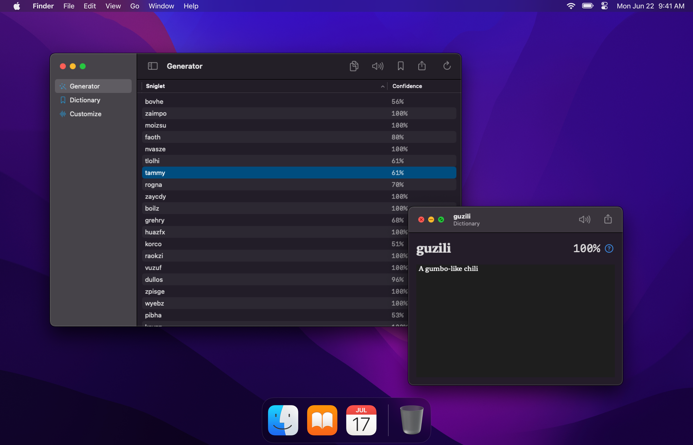

# Give Me A Sniglet!

Give Me a Sniglet is a random word-like generator with an on-device machine learning model that validates whether the
word is likely to be valid. Generate a set of words and view various confidence score, and copy them to your clipboard
with a single tap. Customize the algorithm by changing the size of the words and syllable shapes.

    

This project was originally a part of Codename Abysima as an attempt to generate a language using machine learning.
More information on the original project can be found at https://github.com/alicerunsonfedora/abysima.

## Features

- Generate as many sniglets as you like and share them easily
    - Customize the generation algorithm by adjusting the word length and syllabic shapes
    - Generate sniglets on-the-go with support for Apple Watch
    - Listen to pronunciations of sniglets from your device's language
- View random sniglets on your home screen with the Random Sniglet Widget
    - 🧪 Select from different trained models for validation
- Save your favorite sniglets into a personal dictionary synced with iCloud
    - Assign a definition to your saved sniglets for future reference
    - View a different entry every day with the Daily Saved Sniglet Widget

> *Features marked with 🧪 are in a pre-release state, usually in a TestFlight build.

More information on the features and changes this app has can be found in the CHANGELOG.md file.

## Build from source

**Required Toolchain**

- Xcode 13 or later
- macOS 12.0 Monterey or later
- Apple ID registered with the Apple Developer Program

Clone the repository using `git clone`, and then open the Xcode project. Select any of the three schemes to build that
target, then click the Run button or go to **Product > Run** to run the project.

There are three schemes included in the project:

- **Main App** refers to the primary app for iOS, iPadOS, and macOS. This is likely the scheme you want to use.
- **Widgets** refers to the widgets that are included in the main app. This scheme is typically used to preview the
  widgets available in the main app and should be used for debugging purposes only.
- **Watch App** refers to the app for the Apple Watch. The watch app is a companion to the main app and is embedded in
  the main app when archiving the project.

### CloudKit integration

> Note: This feature is still highly experimental.

Part of this app integrates with CloudKit to store saved sniglets into a user's iCloud account. It is important that you
register the app identifier and enable the iCloud/CloudKit entitlements in your app's identifier. Additionally, you will
want to change the container name to match that of your app's identifier.

Alternatively, you can strip out the CloudKit integration and change `DBController` so that it points to a Core Data
persistent container instead of an iCloud container.

## Found a bug?

Please report an issue on YouTrack at https://youtrack.marquiskurt.net/youtrack/newIssue?project=ABY.

## License

This software is licensed under the Mozilla Public License, v2. More information on your rights can be found in the
LICENSE file.

## Privacy Policy

Please refer to https://marquiskurt.net/app-privacy.html for this app's privacy policy.
